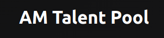

<!-- PROJECT LOGO -->
 

  

<h3 align="center">AM Talent Pool</h3>

  

    This repository contains a simple application for resume registration, developed with the aim of facilitating the resume management process for recruiters and companies.
     
    <a href="#"><strong>Explore the docs »</strong></a>
     
     
    <a href="#" target="_blank" rel="nofollow">View Demo</a>
    ·
  

<!-- ABOUT THE PROJECT -->

## About The Project

[![Product Name Screen Shot][product-screenshot]](#)

(<a href="#readme-top">back to top</a>)

### Built With

- [![React][React.js]][React-url]
- [react-hook-form](https://react-hook-form.com/)
- [zod](https://github.com/colinhacks/zod)
- [@hookform/resolvers](https://github.com/react-hook-form/resolvers)
- [tailwindcss](https://tailwindcss.com/)
- [postcss](https://postcss.org/)
- [autoprefixer](https://github.com/postcss/autoprefixer)

(<a href="#readme-top">back to top</a>)

<!-- LICENSE -->

## License

Distributed under the MIT License. See `LICENSE.txt` for more information.

(<a href="#readme-top">back to top</a>)

<!-- CONTACT -->

## Contact

Eduardo Moraes   [![LinkedIn][linkedin-shield]][linkedin-url]   adomoraes@gmail.com

Project Link: [https://github.com/adomoraes/am-talent-pool](https://github.com/adomoraes/am-talent-pool)

(<a href="#readme-top">back to top</a>)

<!-- MARKDOWN LINKS & IMAGES -->
<!-- https://www.markdownguide.org/basic-syntax/#reference-style-links -->

[contributors-shield]: https://img.shields.io/github/contributors/github_username/repo_name.svg?style=for-the-badge
[contributors-url]: https://github.com/adomoraes/am-talent-pool/graphs/contributors
[forks-shield]: https://img.shields.io/github/forks/github_username/repo_name.svg?style=for-the-badge
[forks-url]: https://github.com/adomoraes/am-talent-pool/network/members
[stars-shield]: https://img.shields.io/github/stars/github_username/repo_name.svg?style=for-the-badge
[stars-url]: https://github.com/adomoraes/am-talent-pool/stargazers
[issues-shield]: https://img.shields.io/github/issues/github_username/repo_name.svg?style=for-the-badge
[issues-url]: https://github.com/adomoraes/am-talent-pool/issues
[license-shield]: https://img.shields.io/github/license/github_username/repo_name.svg?style=for-the-badge
[license-url]: https://github.com/adomoraes/am-talent-pool/blob/master/LICENSE.txt
[linkedin-shield]: https://img.shields.io/badge/-LinkedIn-black.svg?style=for-the-badge&logo=linkedin&colorB=555
[linkedin-url]: https://www.linkedin.com/in/eduardo-moraes-939312143/
[product-screenshot]: images/screenshot.png
[Next.js]: https://img.shields.io/badge/next.js-000000?style=for-the-badge&logo=nextdotjs&logoColor=white
[Next-url]: https://nextjs.org/
[React.js]: https://img.shields.io/badge/React-20232A?style=for-the-badge&logo=react&logoColor=61DAFB
[React-url]: https://reactjs.org/
[Bootstrap.com]: https://img.shields.io/badge/Bootstrap-563D7C?style=for-the-badge&logo=bootstrap&logoColor=white
[Bootstrap-url]: https://getbootstrap.com
[JQuery.com]: https://img.shields.io/badge/jQuery-0769AD?style=for-the-badge&logo=jquery&logoColor=white
[JQuery-url]: https://jquery.com
